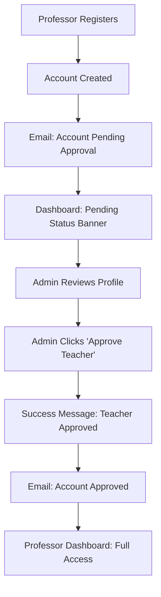
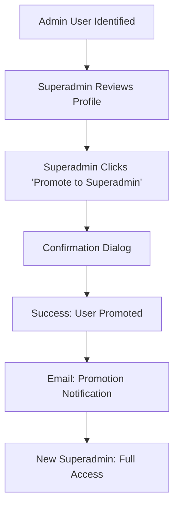

# UX Flow Design: Teacher Approval & Superadmin Management

## 🎯 User Experience Strategy

This document outlines the user experience design for the new teacher approval and superadmin promotion features, focusing on intuitive workflows and clear user communication.

## User Roles & Permissions Matrix

| Action | Default User | Professor | Admin | Superadmin |
|--------|-------------|-----------|-------|------------|
| View own profile | ✅ | ✅ | ✅ | ✅ |
| View user list | ❌ | ❌ | ✅ | ✅ |
| Approve teachers | ❌ | ❌ | ✅ | ✅ |
| Promote to superadmin | ❌ | ❌ | ❌ | ✅ |
| Manage submissions | ❌ | ✅* | ✅ | ✅ |

*Only if `isTeacherActive: true`

## Core User Journeys

### 1. 👨‍🏫 Professor Activation Journey

#### Current State Issues:
- Professors register but can't use teacher features
- No clear indication of approval status
- No communication about next steps

#### Improved UX Flow:



#### User Experience Details:

**Step 1: Registration Confirmation**
```
📧 Email Subject: "Conta criada - Aguardando aprovação"
📧 Email Body: 
"Sua conta foi criada com sucesso! Como você se registrou como professor, 
sua conta está aguardando aprovação administrativa para acessar recursos 
específicos de docentes. Você será notificado por email quando sua conta 
for aprovada."
```

**Step 2: Pending Status Display**
```
🟡 Banner: "Sua conta está pendente de aprovação para recursos de professor. 
           Você será notificado quando aprovada."
```

**Step 3: Approval Notification**
```
📧 Email Subject: "Conta aprovada - Acesso completo liberado"
📧 Email Body:
"Parabéns! Sua conta de professor foi aprovada. Agora você tem acesso 
completo a todos os recursos docentes do sistema."
```

### 2. 👑 Superadmin Promotion Journey

#### Current State Issues:
- No clear process for admin promotion
- Confusion about permission levels
- No audit trail for promotions

#### Improved UX Flow:



#### User Experience Details:

**Step 1: Promotion Confirmation**
```
⚠️  Modal Dialog:
"Tem certeza que deseja promover [Nome do Usuário] a Superadministrador?
Esta ação dará acesso completo ao sistema, incluindo a capacidade de 
promover outros usuários."

[Cancelar] [Confirmar Promoção]
```

**Step 2: Success Feedback**
```
✅ Toast Message: "Usuário promovido a Superadministrador com sucesso!"
```

**Step 3: Promotion Notification**
```
📧 Email Subject: "Promoção a Superadministrador"
📧 Email Body:
"Você foi promovido a Superadministrador do sistema WEPGCOMP. 
Agora você tem acesso total ao sistema e pode gerenciar outros usuários."
```

## Frontend Integration Design

### User Management Interface Updates

#### Current Component: `GerenciarUsuario/Gerenciar.tsx`

**Enhanced Status Display:**
```jsx
// Current status indicators
const getStatusBadge = (user) => {
  if (!user.isTeacherActive && user.profile === 'Professor') {
    return <Badge variant="warning">👨‍🏫 Aguardando Aprovação</Badge>
  }
  if (user.isTeacherActive && user.profile === 'Professor') {
    return <Badge variant="success">👨‍🏫 Professor Ativo</Badge>
  }
  if (user.isSuperadmin) {
    return <Badge variant="primary">👑 Superadministrador</Badge>
  }
  return <Badge variant="secondary">👤 Usuário</Badge>
}
```

**Action Buttons Enhancement:**
```jsx
// Dynamic action buttons based on permissions
const getActionButtons = (user, currentUser) => {
  const actions = []
  
  // Teacher approval button
  if (user.profile === 'Professor' && 
      !user.isTeacherActive && 
      (currentUser.level === 'Admin' || currentUser.isSuperadmin)) {
    actions.push(
      <Button 
        variant="success" 
        size="sm"
        onClick={() => approveTeacher(user.id)}
      >
        ✅ Aprovar Professor
      </Button>
    )
  }
  
  // Superadmin promotion button
  if (!user.isSuperadmin && 
      currentUser.isSuperadmin &&
      user.id !== currentUser.id) {
    actions.push(
      <Button 
        variant="primary" 
        size="sm"
        onClick={() => promoteToSuperadmin(user.id)}
      >
        👑 Promover a Superadmin
      </Button>
    )
  }
  
  return actions
}
```

### Dashboard Experience

#### Professor Dashboard Updates
```jsx
// Pending approval state
{!user.isTeacherActive && user.profile === 'Professor' && (
  <Alert variant="warning" className="mb-4">
    <AlertTriangle className="h-4 w-4" />
    <AlertTitle>Conta Pendente de Aprovação</AlertTitle>
    <AlertDescription>
      Sua conta está aguardando aprovação administrativa. Você será 
      notificado por email quando for aprovada e poderá acessar 
      todos os recursos de professor.
    </AlertDescription>
  </Alert>
)}

// Active teacher state  
{user.isTeacherActive && user.profile === 'Professor' && (
  <Alert variant="success" className="mb-4">
    <CheckCircle className="h-4 w-4" />
    <AlertTitle>Conta de Professor Ativa</AlertTitle>
    <AlertDescription>
      Sua conta está ativa! Você tem acesso completo aos recursos 
      de professor do sistema.
    </AlertDescription>
  </Alert>
)}
```

#### Admin Dashboard Updates
```jsx
// Pending approvals widget
const PendingApprovalsWidget = () => {
  const pendingTeachers = users.filter(
    user => user.profile === 'Professor' && !user.isTeacherActive
  )
  
  return (
    <Card>
      <CardHeader>
        <CardTitle>👨‍🏫 Aprovações Pendentes</CardTitle>
      </CardHeader>
      <CardContent>
        {pendingTeachers.length === 0 ? (
          <p className="text-muted-foreground">
            Nenhuma aprovação pendente
          </p>
        ) : (
          <div className="space-y-2">
            {pendingTeachers.map(teacher => (
              <div key={teacher.id} className="flex justify-between items-center">
                <span>{teacher.name}</span>
                <Button 
                  size="sm" 
                  onClick={() => approveTeacher(teacher.id)}
                >
                  Aprovar
                </Button>
              </div>
            ))}
          </div>
        )}
      </CardContent>
    </Card>
  )
}
```

## State Management Integration

### User Context Updates
```jsx
// Enhanced user context with approval actions
const UserContext = createContext({
  // ... existing context
  
  // New approval actions
  approveTeacher: async (userId) => {
    try {
      const response = await api.patch(`/users/${userId}/approve`)
      // Update local state
      setUsers(prev => prev.map(user => 
        user.id === userId 
          ? { ...user, isTeacherActive: true }
          : user
      ))
      // Show success message
      toast.success('Professor aprovado com sucesso!')
    } catch (error) {
      toast.error('Erro ao aprovar professor')
    }
  },
  
  promoteToSuperadmin: async (userId) => {
    try {
      const response = await api.patch(`/users/${userId}/promote`)
      // Update local state
      setUsers(prev => prev.map(user => 
        user.id === userId 
          ? { ...user, isSuperadmin: true, level: 'Superadmin' }
          : user
      ))
      toast.success('Usuário promovido a Superadministrador!')
    } catch (error) {
      toast.error('Erro ao promover usuário')
    }
  }
})
```

## Error Handling & User Feedback

### Error States
```jsx
// Handle different error scenarios
const handleApprovalError = (error) => {
  switch (error.status) {
    case 403:
      toast.error('Você não tem permissão para esta ação')
      break
    case 404:
      toast.error('Usuário não encontrado')
      break
    case 409:
      toast.warning('Usuário já está aprovado')
      break
    default:
      toast.error('Erro interno do servidor')
  }
}
```

### Loading States
```jsx
// Loading indicators for async actions
const [loadingApprovals, setLoadingApprovals] = useState(new Set())

const approveTeacher = async (userId) => {
  setLoadingApprovals(prev => new Set(prev).add(userId))
  try {
    // ... approval logic
  } finally {
    setLoadingApprovals(prev => {
      const next = new Set(prev)
      next.delete(userId)
      return next
    })
  }
}

// In component
<Button 
  disabled={loadingApprovals.has(user.id)}
  onClick={() => approveTeacher(user.id)}
>
  {loadingApprovals.has(user.id) ? (
    <>
      <Loader2 className="mr-2 h-4 w-4 animate-spin" />
      Aprovando...
    </>
  ) : (
    '✅ Aprovar Professor'
  )}
</Button>
```

## Mobile Experience Considerations

### Responsive Design
```jsx
// Mobile-optimized action buttons
<div className="flex flex-col sm:flex-row gap-2">
  {getActionButtons(user, currentUser).map((button, index) => (
    <div key={index} className="w-full sm:w-auto">
      {button}
    </div>
  ))}
</div>
```

### Touch-Friendly Interactions
- Minimum 44px touch targets
- Clear visual feedback on touch
- Confirmation dialogs for destructive actions

## Accessibility Features

### Screen Reader Support
```jsx
// Accessible status indicators
<span 
  className="sr-only"
  aria-label={`Status: ${getStatusText(user)}`}
>
  {getStatusBadge(user)}
</span>
```

### Keyboard Navigation
- Tab order follows logical flow
- Enter/Space activate buttons
- Escape closes modals

## Performance Optimizations

### Optimistic Updates
```jsx
// Update UI immediately, rollback on error
const approveTeacher = async (userId) => {
  // Optimistic update
  setUsers(prev => prev.map(user => 
    user.id === userId 
      ? { ...user, isTeacherActive: true }
      : user
  ))
  
  try {
    await api.patch(`/users/${userId}/approve`)
    toast.success('Professor aprovado!')
  } catch (error) {
    // Rollback on error
    setUsers(prev => prev.map(user => 
      user.id === userId 
        ? { ...user, isTeacherActive: false }
        : user
    ))
    handleApprovalError(error)
  }
}
```

### Memoization for Performance
```jsx
// Memoize expensive calculations
const pendingTeachers = useMemo(() => 
  users.filter(user => 
    user.profile === 'Professor' && !user.isTeacherActive
  ), [users]
)
```

## Analytics & Monitoring

### User Events Tracking
```jsx
// Track important user actions
const approveTeacher = async (userId) => {
  // ... approval logic
  
  // Track event
  analytics.track('teacher_approved', {
    approver_id: currentUser.id,
    teacher_id: userId,
    timestamp: new Date().toISOString()
  })
}
```

## Testing Scenarios

### User Acceptance Test Cases

1. **Professor Registration Flow**
   - Register as professor → See pending status → Get approved → Access teacher features

2. **Admin Approval Workflow**
   - Login as admin → See pending professors → Approve → Verify success

3. **Superadmin Promotion Flow**
   - Login as superadmin → Find admin user → Promote → Verify new permissions

4. **Permission Verification**
   - Test each role sees appropriate UI elements
   - Test unauthorized actions are prevented

5. **Error Handling**
   - Test network failures gracefully handled
   - Test permission errors show helpful messages

## Implementation Priority

### Phase 1: Core Functionality (Week 1)
- ✅ Backend API endpoints
- ✅ Database schema updates
- 🔄 Basic frontend integration

### Phase 2: Enhanced UX (Week 2)
- Status indicators and badges
- Action buttons with loading states
- Success/error messaging

### Phase 3: Polish & Optimization (Week 3)
- Email notifications
- Optimistic updates
- Mobile optimization
- Analytics tracking

## Success Metrics

### User Experience KPIs
- Time to complete teacher approval: < 30 seconds
- User confusion rate: < 5% (support tickets)
- Mobile usability score: > 90%
- Accessibility compliance: WCAG 2.1 AA

### Business Impact
- Reduced admin workload for user management
- Faster professor onboarding
- Clear audit trail for permissions
- Improved user satisfaction scores

---

This UX design ensures the teacher approval and superadmin features provide an intuitive, efficient, and delightful user experience while maintaining security and system integrity.
